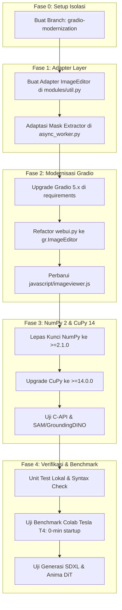

# Roadmap Modernisasi Stack Fooocus: Gradio 5/6, NumPy 2.x, CuPy v14 & Paket Mutakhir (Fooocus Next-Gen Architecture)

Dokumen ini adalah **cetak biru teknis (technical blueprint) dan panduan arsitektural** untuk memodernisasi repositori Fooocus (SayMaven Fork) dari fondasi legacy (Gradio 3.x, NumPy 1.x, CuPy v13) menuju ekosistem Python modern terkini (**Gradio 5/6**, **NumPy 2.x**, **CuPy v14**, **FastAPI 0.115+**, dan **Starlette 0.41+**).

---

## 1. Executive Summary & Tujuan

### Mengapa Modernisasi Ini Diperlukan?
1. **Peningkatan Performa Startup (0 Menit vs 7 Menit):**
   * Di lingkungan Python 3.13 Google Colab, `numpy<2.0.0` tidak memiliki binary `.whl` resmi, memaksa Pip mengompilasi dari source code Meson/Ninja/GCC selama ~7 menit pada setiap *fresh install*.
   * `numpy>=2.1.0` memiliki binary `.whl` resmi siap pakai untuk Python 3.13, mengeliminasi waktu kompilasi 7 menit secara instan.
2. **Kinerja GPU & Dukungan CUDA 12.8+ Modern:**
   * CuPy v14 (`cupy-cuda12x>=14.0.0`) membawa optimasi CUDA stream graph dan alokator memori yang jauh lebih cepat dibanding CuPy v13, namun membutuhkan ABI C-API NumPy 2.x.
3. **Fitur WebUI & Keamanan Modern:**
   * Gradio 3.x telah mencapai status EOL (*End of Life*) dengan kerentanan keamanan lama dan tidak kompatibel dengan Starlette modern ($\ge 0.38$).
   * Gradio 5/6 membawa arsitektur Svelte modern, SSR yang lebih cepat, streaming WebSocket yang lebih stabil, serta komponen kanvas gambar modular (`ImageEditor`).

---

## 2. Matriks Dependensi: Status Saat Ini vs Target Modernisasi

| Komponen / Library | Versi Saat Ini (`anima-support`) | Versi Target Modernisasi | Dampak Arsitektur & Ketergantungan |
| :--- | :--- | :--- | :--- |
| **Gradio** | `gradio>=3.41.2,<4.0.0` (3.50.2) | `gradio>=5.0.0` (atau v6.x) | **Major Breaking Changes:** Komponen sketch diganti `ImageEditor`, event system baru, DOM Svelte baru. |
| **NumPy** | `numpy>=1.26.0,<2.0.0` (1.26.4) | `numpy>=2.1.0` | **Terkunci oleh Gradio 3.** Begitu Gradio naik ke v5+, NumPy 2.x otomatis bisa diaktifkan. |
| **CuPy** | `cupy-cuda12x>=13.0.0,<14.0.0` | `cupy-cuda12x>=14.0.0` | Memerlukan ABI NumPy 2.x. Sinkronisasi wajib dengan NumPy 2. |
| **Starlette** | `starlette==0.37.2` | `starlette>=0.41.0` | Terbuka otomatis saat Gradio di-upgrade ke v5+. |
| **FastAPI** | `fastapi==0.112.2` | `fastapi>=0.115.0` | Terbuka otomatis saat Gradio di-upgrade ke v5+. |
| **PyTorch & CUDA** | `torch>=2.4.0` | `torch>=2.5.0` (CUDA 12.4/12.8) | Sudah kompatibel. |
| **Transformers** | `transformers>=4.42.4` (5.x comp) | `transformers>=4.48.0` / 5.x | Sudah diamankan oleh patch flattened CLIP di `ldm_patched`. |
| **GroundingDINO** | `groundingdino-py>=0.4.0` | Fork NumPy 2.x compatible | Perlu validasi ABI C-extension pada NumPy 2. |
| **Segment Anything** | `segment_anything>=1.0` | `segment_anything>=1.0` (patched) | Menggunakan PyTorch native, umumnya aman pada NumPy 2. |
| **ONNX Runtime** | `onnxruntime>=1.18.0` | `onnxruntime>=1.20.0` | Aman & 100% kompatibel NumPy 2.x. |

---

## 3. Analisis 4 Tantangan Teknis Utama (The 4 Major Hurdles)

### Tantangan 1: Migrasi dari `grh.Image(tool='sketch')` ke `gr.ImageEditor` (Tantangan Terberat)
- **Akar Masalah:**
  - Di Gradio 3, Fooocus menggunakan subclass `grh.Image` di [`modules/ui_gradio_extensions.py`](modules/ui_gradio_extensions.py) dengan mode `tool='sketch'`.
  - Komponen lama mengembalikan tuple 2 elemen sederhana: `(numpy_image, numpy_mask)`.
  - Di Gradio 5/6, mode `tool='sketch'` telah **dihapus total** dan digantikan oleh `gr.ImageEditor`.
  - `gr.ImageEditor` mengembalikan dictionary kompleks:
    ```python
    {
        "background": PIL.Image,
        "layers": [PIL.Image, ...],
        "composite": PIL.Image
    }
    ```
- **Solusi Arsitektur:**
  1. Buat layer adapter `extract_inpaint_mask(image_editor_data)` di `modules/util.py`:
     - Memeriksa apakah `image_editor_data` berbentuk dictionary (`ImageEditor`).
     - Menggabungkan layer alpha dari `layers` untuk membentuk binary mask numpy 2D `(H, W)`.
     - Mengekstrak `background` sebagai RGB input image `(H, W, 3)`.
  2. Perbarui seluruh handler inpaint di [`webui.py`](webui.py) (`inpaint_input_image`, `inpaint_mask_image`) dan [`modules/async_worker.py`](modules/async_worker.py).

---

### Tantangan 2: Event System, Visibility Toggles, & Deprekasi `gr.update`
- **Akar Masalah:**
  - Di Gradio 3, Fooocus sangat bergantung pada pemanggilan:
    ```python
    return [gr.update(visible=True), gr.update(value="..."), ...]
    ```
  - Di Gradio 5/6, pola `gr.update` mengalami perubahan validasi ketat. Beberapa komponen menuntut pengembalian objek komponen atau skema eksplisit `{"visible": True, "value": ...}`.
- **Solusi Arsitektur:**
  1. Standarisasi helper fungsi UI wrapper yang mengonversi tuple/list update ke format kompatibel Gradio 5.
  2. Audit seluruh fungsi toggle dinamis (seperti `inpaint_mode_change`, `preset_selection_change`, dan accordion tabs).

---

### Tantangan 3: Penulisan Ulang Frontend JavaScript & DOM CSS (`imageviewer.js`)
- **Akar Masalah:**
  - Gradio 5/6 dibangun menggunakan framework Svelte modern dengan Web Components / Shadow DOM terenkapsulasi.
  - Class bawaan seperti `.main_view`, `.final_gallery`, `.resizable_area`, serta struktur elemen `div` galeri telah berganti nama.
  - Fitur interaktif kustom Fooocus (Canvas Pan & Zoom, 3-Stage Fullscreen Lightbox Modal, keyboard arrows `ArrowLeft`/`ArrowRight`, tombol fullscreen) di [`javascript/imageviewer.js`](javascript/imageviewer.js) akan putus jika selector DOM tidak disesuaikan.
- **Solusi Arsitektur:**
  1. Identifikasi struktur DOM baru galeri Gradio 5/6 (`gradio-app`, `gradio-gallery`).
  2. Adaptasikan event listener `imageviewer.js` agar membaca elemen galeri melalui attribute selector yang stabil (`[data-testid="image"]` atau custom elem_id).

---

### Tantangan 4: Verifikasi Kompatibilitas ABI NumPy 2.x pada Library Pendukung
- **Akar Masalah:**
  - NumPy 2.0 merombak C-API (`_ARRAY_API`) dan mengganti beberapa tipe internal (`np.float_`, `np.int_`, ABI struct alignment).
  - Library yang memiliki ekstensi C/C++ kompilasi (seperti `groundingdino-py`, `scipy`, `opencv`) wajib dikompilasi terhadap NumPy 2 atau tidak memanggil internal C-API lama.
- **Solusi Arsitektur:**
  1. Verifikasi `opencv-contrib-python-headless>=4.10.0.84` (versi ini sudah resmi mendukung NumPy 2).
  2. Verifikasi `scipy>=1.14.0` (versi ini sudah resmi mendukung NumPy 2).
  3. Untuk GroundingDINO: jika binary extension C++ lama bermasalah di NumPy 2, gunakan implementasi GroundingDINO murni PyTorch atau alternatif detektor YOLOv8 yang sudah 100% native NumPy 2.

---

## 4. Rencana Kerja Bertahap (Step-by-Step Implementation Phases)



### Fase 0: Isolasi Branch Kerja
* Pekerjaan dilakukan **eksklusif** di branch baru (misal `gradio-modernization`).
* Branch `anima-support` dan `colab-support` tetap dipertahankan 100% stabil untuk pengguna aktif harian.

### Fase 1: Abstraksi Data Masking & Image Input
1. Modifikasi [`modules/util.py`](modules/util.py): Tambahkan utilitas untuk mengekstrak layer mask dan composite image dari format data Gradio 5 `ImageEditor`.
2. Modifikasi [`modules/async_worker.py`](modules/async_worker.py): Buat input handler defensif yang menerima input gambar baik format lama (tuple Gradio 3) maupun format baru (dict Gradio 5).

### Fase 2: Upgrade Gradio 5 & Rombak `webui.py`
1. Ubah dependensi di `requirements_versions.txt`:
   ```text
   gradio>=5.15.0
   starlette>=0.41.0
   fastapi>=0.115.0
   ```
2. Ganti deklarasi `inpaint_input_image = grh.Image(...)` di `webui.py` dengan:
   ```python
   inpaint_input_image = gr.ImageEditor(
       label='Image to Inpaint',
       type='numpy',
       brush=gr.Brush(colors=['#FFFFFF'], default_color='#FFFFFF'),
       eraser=gr.Eraser()
   )
   ```
3. Audit dan perbarui pemanggilan `inpaint_mode_change` dan event update lainnya.
4. Adaptasikan [`javascript/imageviewer.js`](javascript/imageviewer.js) agar kompatibel dengan DOM Gradio 5.

### Fase 3: Upgrade NumPy 2.x & CuPy v14
1. Buka penguncian di `requirements_versions.txt`:
   ```text
   numpy>=2.1.0
   cupy-cuda12x>=14.0.0
   ```
2. Verifikasi inferensi model difusi:
   - Anima DiT reference sampler (`WanVAE`, `MiniTrainDIT`).
   - SDXL native ksampler.
   - Detektor YOLO ONNX (`onnxruntime` CUDA provider).
3. Verifikasi apakah `segment_anything` (SAM) dan `groundingdino-py` melempar error ABI. Jika ya, terapkan patch ABI NumPy 2.

### Fase 4: Validasi & Pengujian Colab
1. **Uji Beban Startup:** Verifikasi bahwa instalasi di Colab Python 3.13 tidak lagi menjalankan kompilasi source code NumPy 1.26.4 (waktu tunggu terpangkas dari 7 menit menjadi <30 detik).
2. **Uji Fungsionalitas Lengkap:**
   * Text-to-Image (SDXL & Anima DiT).
   * Image-to-Image / Inpaint / Outpaint (menggunakan ImageEditor baru).
   * Enhance Multi-Tab YOLO (Face, Hand, Eyes).
   * ControlNet-LLLite.
   * Fullscreen Lightbox & Canvas Zoom.

---

## 5. Ringkasan Rekomendasi untuk Pengembang

1. **Jaga Stabilitas Produksi:**  
   Branch `anima-support` saat ini adalah versi paling handal untuk pengguna harian. Jangan gabungkan perubahan modernisasi stack ini ke `anima-support` sebelum seluruh Fase 1 s/d Fase 4 tervalidasi 100% lulus uji.
2. **Prioritas Refactoring:**  
   Fokuskan tenaga pada adaptasi `gr.ImageEditor` terlebih dahulu. Setelah komponen editor gambar berjalan mulus, pelepasan NumPy 2 dan CuPy 14 akan jauh lebih mudah diselesaikan.
